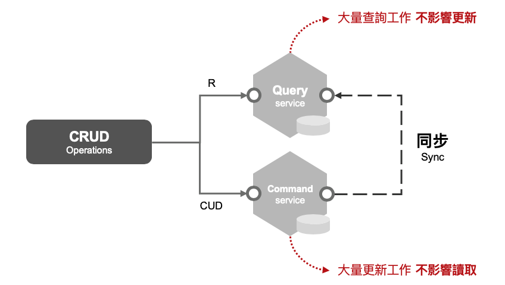

# kratos-cqrs

## 什么是 CQRS

命令查询的责任分离Command Query Responsibility Segregation (简称CQRS)模式是一种架构体系模式，能够使改变模型的状态的命令和模型状态的查询实现分离。这属于DDD应用领域的一个模式，主要解决DDD在数据库报表输出上处理方式。

曾经是 读写分离:


在微服务的时代,变成了这样:



## 项目简要说明

项目分为两个微服务:

- 日志查询服务(kratos.logger.service)
- 日志写入服务(kratos.logger.job)

### 日志查询服务

- 开了gRPC服务用来给其他服务查询之用
- 数据库连接的是TimeScaleDB
- 使用了ent.go这个ORM库

### 日志写入服务

开了Kafka连接,订阅了以下几个Topic:

- `logger.sensor.ts` 用于写入传感器的遥感数据
- `logger.sensor.instance` 用于写入传感器的实体数据

## 技术栈

- [Kratos](https://go-kratos.dev/)
- [TimeScaleDB](https://www.timescale.com/)
- [Kafka](https://kafka.apache.org/)
- [Consul](https://www.consul.io/)
- [Jaeger](https://www.jaegertracing.io/)
- [Entgo](https://entgo.io/)

## Docker部署开发服务器

### TimeScaleDB

```shell
docker pull timescale/timescaledb:latest-pg14
docker pull timescale/timescaledb-postgis:latest-pg13
docker pull timescale/pg_prometheus:latest-pg11

docker run -itd \
    --name timescale-test \
    -p 5432:5432 \
    -e POSTGRES_PASSWORD=123456 \
    timescale/timescaledb-postgis:latest-pg13
```

### Kafka

```shell
docker pull bitnami/kafka:latest
docker pull bitnami/zookeeper:latest
docker pull hlebalbau/kafka-manager:latest

docker run -itd \
    --name zookeeper-test \
    -p 2181:2181 \
    -e ALLOW_ANONYMOUS_LOGIN=yes \
    bitnami/zookeeper:latest

docker run -itd \
    --name kafka-standalone \
    --link zookeeper-test \
    -p 9092:9092 \
    -v /home/data/kafka:/bitnami/kafka \
    -e KAFKA_BROKER_ID=1 \
    -e KAFKA_LISTENERS=PLAINTEXT://:9092 \
    -e KAFKA_ADVERTISED_LISTENERS=PLAINTEXT://127.0.0.1:9092 \
    -e KAFKA_ZOOKEEPER_CONNECT=zookeeper-test:2181 \
    -e ALLOW_PLAINTEXT_LISTENER=yes \
    --user root \
    bitnami/kafka:latest

docker run -itd \
     -p 9000:9000  \
     -e ZK_HOSTS="localhost:2181" \
     hlebalbau/kafka-manager:latest
```

### Consul

```shell
docker pull bitnami/consul:latest

docker run -itd \
    --name consul-server-standalone \
    -p 8300:8300 \
    -p 8500:8500 \
    -p 8600:8600/udp \
    -e CONSUL_BIND_INTERFACE='eth0' \
    -e CONSUL_AGENT_MODE=server \
    -e CONSUL_ENABLE_UI=true \
    -e CONSUL_BOOTSTRAP_EXPECT=1 \
    -e CONSUL_CLIENT_LAN_ADDRESS=0.0.0.0 \
    bitnami/consul:latest
```

### Jaeger

```shell
docker pull jaegertracing/all-in-one:latest

docker run -d \
    --name jaeger \
    -e COLLECTOR_ZIPKIN_HOST_PORT=:9411 \
    -p 5775:5775/udp \
    -p 6831:6831/udp \
    -p 6832:6832/udp \
    -p 5778:5778 \
    -p 16686:16686 \
    -p 14268:14268 \
    -p 14250:14250 \
    -p 9411:9411 \
    jaegertracing/all-in-one:latest
```

## 测试

下载 [Postman](https://www.postman.com/downloads/) 发起gRPC请求.

下载 [Offset Explorer](https://www.kafkatool.com/download.html) 向 Topic ```logger.sensor.ts``` 发送JSON数据:

```json
[{"ts": 1646409307, "sensor_id": 1, "temperature":30, "cpu":20}]
```

## 参考资料

- [淺談 CQRS 的實現方法](https://medium.brobridge.com/%E6%B7%BA%E8%AB%87-cqrs-%E5%AF%A6%E7%8F%BE%E6%96%B9%E6%B3%95-3b4fcb8d5c86)
